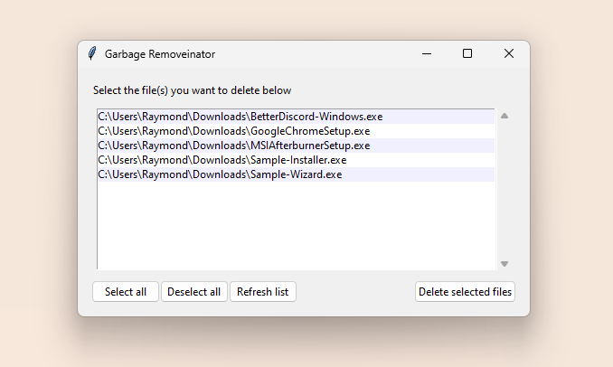

# Garbage Removal Utility for Windows

A basic and powerful tool to assist in removing leftover installer files from almost anywhere on your system.

This is my first attempt at creating software ready for distribution, the goal being to make it usable on any Windows machine. It falls a bit short of this vision for now, as I've seen the garbage scanning algorithm error and crash on some computers. Whether I'll fix this and/or expand on it's function, I don't know. But this project was valuable in teaching me the basics of making a program both user-friendly and compatible with machines other than mine.

## Build Dependencies
**Python (3.7+)**
> [Download Python](https://www.python.org "Click here to redirect!")

**PyInstaller**
> `pip install pyinstaller` \
> [Getting Started & Documentation](https://pyinstaller.org/en/stable "Click here to redirect!")

**C++ (2017+)**
> [Download MSYS2](https://www.msys2.org "Click here to redirect!")

## Contributors
**Raymond Chen** - *sameriterl* (Discord)
